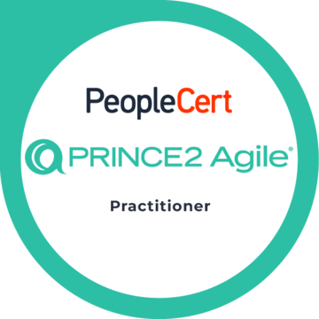
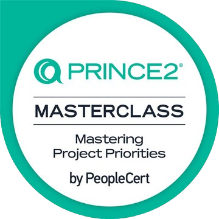
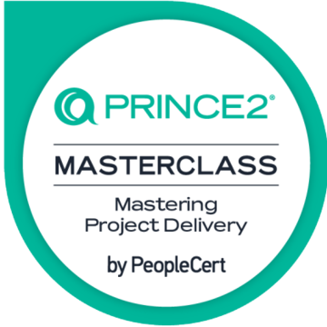
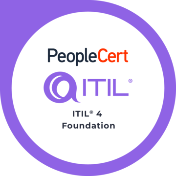
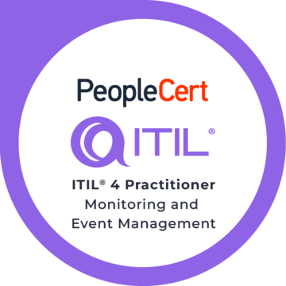
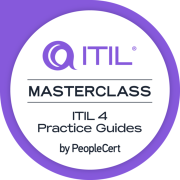
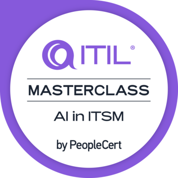

👋 Oh, hello there, wandering mind 🌱

Welcome to my GitHub — I’m ILXNAH (she/her).

I’m an early-career DevOps engineer and occasional meme enthusiast (you guessed it).  
My passion lies in automation, infrastructure, and building better solutions.  
I navigate complex challenges with persistence and an open mind, consistently embracing a learner’s mindset.  
Here’s what’s keeping me curious these days 👇

## Currently working on
- Advancing hands-on experience with Docker and Kubernetes — [see my repo](https://github.com/ILXNAH/docker-and-k8s)
- Improving coding skills and deepening understanding of runtime environments, observability, error handling, and code efficiency
- Refining workflows for infrastructure deployments and container orchestration
- Growing expertise in cybersec (NIS2) & modern process management (ITIL® 4 Practitioner, PRINCE2® Agile Expert)

📄 [View my CV](https://ilxnah.github.io/cv/ilona-louckova.pdf)

## PeopleCert Credentials

  
  
  
  
  
  
  
  

## Hobbies & Sporadic Interests
🎨 ~ Oil painting and pastel pencil drawing  
🤸‍♀️ ~ Onewheel riding, yoga, headstands ***and*** handstands (life’s just better upside down, isn’t it?)  
🔮 ~ Spirituality, psychology, esoterics, and metaphysics  

  
---
#on-the-path #looking-for-allies

> _"And in case I don't see ya, Good afternoon, Good evening, and Good night!"_ 🎬🌙
